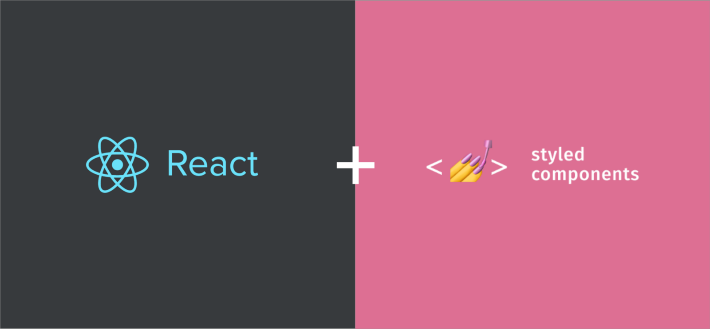

<p class="desktop-gif"></p>
<p class="mobile-gif"></p>

Esse GIF foi uma das primeiras animações que eu fiz, o processo de implementação foi bem legal. O resultado é replicável e relativamente elegante, pelo menos a solução, rs. Então pensei "Por que não escrever sobre isso?" e aqui estamos.

Antes de tudo, e por pura curiosidade, a frase do GIF é a 3º lei de Clarke, que faz parte de uma série de premissas escritas por Arthur C. Clarke, o autor de 2001: Uma Odisséia no Espaço.

Mas vamos ao ponto...

## Do que vamos precisar



Seria impossível explicar tudo nos mínimos detalhes, então vou colocar logo abaixo algumas referências bem pontuais.

  - Caso prefira uma solução apenas com CSS eu recomendo esse [post do css-tricks][0] sobre typewriter effect.
  - [Um guia completo para useEffect][1], pelo Dan Abramanov
  - E esse [artigo sobre animações básicas][2] com styled components e react


## TLDR

>"Me dá o código, pls!" — Qualquer dev lendo isso.

Se bateu aquela preguiça é só dar uma olhada nesse [gihub gist][3], onde o componente já está pronto. Aí é só usar! ;)

---

## Implementação

Vamos começar pelo mais tranquilo, a estilização. Precisaremos de dois elementos básicos, um container e algo que imite o cursor de texto, vulgo "treco que pisca".

Para o "treco que pisca" vamos implementar um `<span />` com uma borda que oscila sua cor entre transparente e visível, criando o efeito de "blink" do cursor. Dito isso, para atingir esse efeito temos que nos atentar a coisas como:

  - A animação é cíclica, portanto infinita
  - E ela depende de um ínicio (borda transparente) e fim (borda visível), basicamente uma regra

Na prática, pro CSS, essa "regra" têm um nome, `keyframes`. Se a animação fosse um GPS, os keyframes seriam a origem e o destino. Vou exemplificar melhor:

```jsx{4, 5}
import styled, { keyframes } from 'styled-components;

const blinkTextCursor = keyframes`
  from {border-right-color: rgba(0, 0, 0, .75);}
  to {border-right-color: transparent}
`;

const TextCursor = styled.span`
  border-right: 2px solid rgba(0, 0, 0, .75);
  display: inline;

  /* A mágica acontece aqui */
  animation: ${blinkTextCursor} 0.7s steps(44) infinite normal;
`;

const Container = styled.p`
  display: inline-block;
  margin: 0;
`;
```

Feito isso, o objetivo é usar em nossas aplicações um componente que recebe a frase como parâmetro, vulgo `prop`. Vide exemplo abaixo:

```jsx{}
class App extends Component {
  render() {
    return (
      <TypeWriter value="Qualquer tecnologia suficientemente 
      avançada é indistinguível de magia" />
    );
  }
}
```

Dito isso, vamos criá-lo:

```jsx{}
// Eu vou explicar, ok? XD
function TypeWriter({ value }) {
  const [text, setText] = useState('');

  const typeWriter = (text, i = 0) => {
    if (i < value.length) {
      setText(text.slice(0, i + 1));
      setTimeout(() => {
        typeWriter(text, i + 1);
      }, 100);
    }
  };

  useEffect(() => {
    typeWriter(value);
  }, []);

  return (
    <Container>
      {text}
      <TextCursor />
    </Container>
  );
}
```

>"Legal, mas o que diabos isso faz?" - Qualquer pessoa.

Bem, isso brinca um pouco com o ciclo de vida do React, gerando várias atualizações de estado em sequência, caractere por carectere, para simular a digitação da frase. Isso, junto e misturado com nosso "treco que pisca", que tá lá existindo feliz e vitaminado, cria a bela ilusão de "texto sendo escrito".

### A função que faz a mágica

No meio do corpo do código tem uma func recursiva, que é a alma da animação. Eu a nomeei `typeWriter`. A sua tarefa? atualizar o valor da variável `text`, que é renderizada no front, a cada chamada de função. Nisso o DOM pensa "Hm, essa váriavel mudou de valor, melhor atualizar" e atualiza com um novo caractere (Lembra disso no parágrafo anterior?). Tentei deixar bem detalhado abaixo. Dá uma olhada:

```jsx{9}
// Começamos com 0
const typeWriter = (text, i = 0) => {

  // E garantimos que a condição de parada seja "acabou a frase"
  if (i < value.length) {

    /* Cortamos nossa frase, e atualizamos nosso estado
    com o novo valor, que agora tem mais uma letra */
    setText(text.slice(0, i + 1));

    /* Agora é só chamar a função de novo, incrementando
    nossa variável de "corte" e colocando um tempo
    de 100ms para a execução, afinal ninguém
    digita absurdamente rápido, né? */
    setTimeout(() => {
      typeWriter(text, i + 1);
    }, 100);
  }
};
```

## Conclusão

Primeiramente, fica um abração para o ser que teve paciência de ler meu humilde espaço de devaneio pessoal até aqui. Obrigado!

Se quiser dar um feedback, ou tirar alguma dúvida, é só me marcar no Twitter (Tem um link lá no finalzinho do blog, vou tentar usar com mais frequência).
Aceito sugestões de temas para novos conteúdos também.

Além disso, o blog é todo open source e você pode contribuir com [esse post][4] diretamente lá no Github.

[0]: https://css-tricks.com/snippets/css/typewriter-effect/
[1]: https://overreacted.io/pt-br/a-complete-guide-to-useeffect/
[2]: https://codeburst.io/animating-react-components-with-css-and-styled-components-cc5a0585f105
[3]: https://gist.github.com/luizmariz/0478d3561bcd91dd885376625aead768
[4]: https://github.com/luizmariz/luizmariz.github.io/blob/development/src/pages/blog/criando-uma-anima%C3%A7%C3%A3o-de-typewriter-com-react-hooks-e-styled-components/index.md