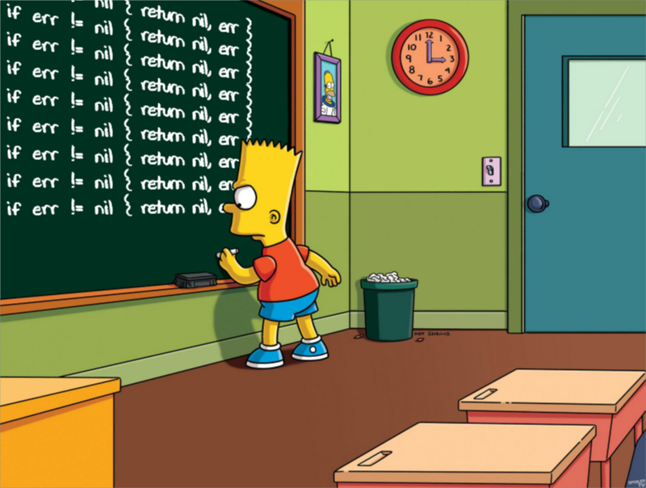

##Mas pera, por que não fazer um post de verdade?

Falta de criatividade? talvez. Mas acredito ser o mais puro desespero de ver esse MVP sair. E, após meses de curadoria das docs do [Gatsby][0], aqui estamos.

Outro ponto positivo de escrever uma coisa bem aleátoria é poder usar e abusar do `Markdown` pra testar o comportamento do blog fazendo, por exemplo, uma crítica pra lá de construtiva ao golang com um meme.



Mas o que seria um blog de desenvolvimento sem links e exemplos né. Então se ficou interessado no jeito que o Go lida com os erros é só clicar [aqui][1]. Anyway, exemplo nunca é de mais né.

```go
package main

import "errors"
import "fmt"

// Essa bela função admite apenas 1 como
// argumento. Caso não seja 1, retornamos um erro

func soAceitaUm (num int) (int, error) {
  if num != 1 {
    return -1, errors.New("Só aceita 1")
  }

  return 1, nil
}
```
> Você pode nunca lidar com os seus erros, só não deve

##Conclusão

Muito texto já né, segue uma pseudo playlist by Lonely Islands:
  - [Oakland Nights][2]
  - [I'm So Humble][3]
  - [Great Day][4]
  - [I'm On A Boat][5]

[0]: https://www.gatsbyjs.org/docs/
[1]: http://goporexemplo.golangbr.org/errors.html
[2]: https://www.youtube.com/watch?v=LD4ryByjVyo
[3]: https://www.youtube.com/watch?v=XzbAEHdy8oU
[4]: https://www.youtube.com/watch?v=WRu_-9MBpd4
[5]: https://www.youtube.com/watch?v=R7yfISlGLNU&list=PL30470E52342B95EB&index=2&t=0s